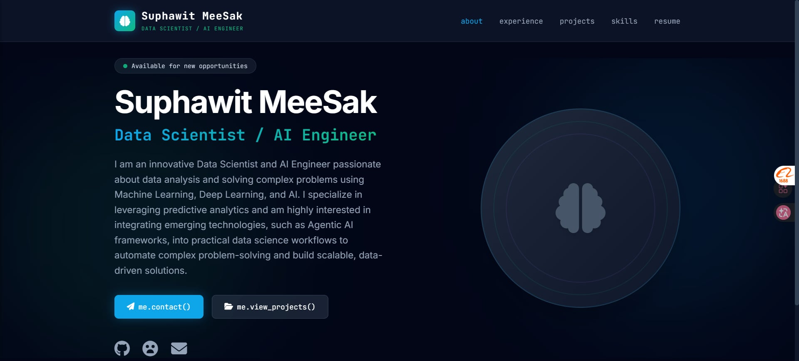

# 🚀 My AI & Data Science Portfolio

  

---

## 📸 Web App Preview

---

## 🌟 Overview

This repository is dedicated to hosting my personal portfolio web application. It serves as a centralized hub to showcase my expertise in **Data Science, Machine Learning, and AI Engineering**.

Built with **Django** and **Tailwind CSS**, and deployed via **Vercel**, this project demonstrates my ability to bridge the gap between complex AI models and user-friendly web interfaces.

---

## 🛠️ Built With

* **Language:** Python 3.12+
* **Framework:** Django
* **Styling:** Tailwind CSS
* **Deployment:** Vercel (Serverless Architecture)

---

## 👤 Author

**Suphawit MeeSak**

*Junior Data Scientist / Junior AI Engineer*

* 📧 **Email:** Suphawit11@icloud.com
* 🔗 **LinkedIn:** [Suphawit MeeSak](https://www.linkedin.com/in/suphawit-meesak/)
* 💻 **GitHub:** [palmyz000](https://github.com/palmyz000)
* 🤗 **Hugging Face:** [palmyz0](https://huggingface.co/palmyz0)
* 🌐 **Portfolio:** [suphawit-portfolio.vercel.app](https://palmyz0-portfolio.vercel.app/)